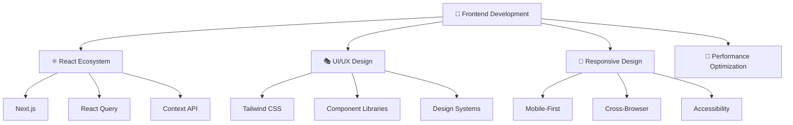

<div align="center">

# 🌟 Welcome to Eshani's Digital Universe 🌟


<br>


</div>

---

## 🎭 About Me - The Digital Storyteller

<table>
<tr>
<td width="50%">

### 🌸 Who Am I?

```typescript
interface Developer {
  name: string;
  role: string;
  education: string;
  passions: string[];
  currentJourney: string;
  specialties: string[];
  mindset: string;
}

const eshani: Developer = {
  name: "Eshani Paul",
  role: "Frontend Developer & Tech Enthusiast",
  education: "First-year BCA Student 🎓",
  passions: [
    "Crafting Beautiful UIs ✨",
    "Exploring AI/ML Frontiers 🤖",
    "Building Seamless UX 🎨"
  ],
  currentJourney: "Learning Backend Development 🔧",
  specialties: [
    "React & Next.js Magic",
    "Responsive Design Wizardry",
    "Interactive Web Experiences"
  ],
  mindset: "Code with purpose, learn with passion 🚀"
};

// Life philosophy
const myMotto = () => {
  return "Turning creative visions into digital reality!";
};
```

### 🎯 My Current Adventures
- 🎤 **Community Evangelist** @ Hack4Bengal 4.0
- 🤖 **AI Research Intern** @ AI Wallah  
- 💻 **Technical Contributor** @ GeeksforGeeks SNU Chapter
- 📚 **Continuous Learner** in the Tech Universe

</td>
<td width="50%">

<div align="center">


<br><br>


<br><br>


</div>

</td>
</tr>
</table>

---

<div align="center">

## 🌐 Connect & Collaborate


<br><br>

<a href="https://instagram.com/eiizz_zz">

</a>
<a href="https://www.linkedin.com/public-profile/settings?trk=d_flagship3_profile_self_view_public_profile">

</a>
<a href="mailto:pauleshani06@gmail.com">

</a>

<br>


</div>

---

<div align="center">

## 💻 My Tech Universe


<br><br>

</div>

<table width="100%">
<tr>
<td width="50%" valign="top">

### 🎨 **Frontend Mastery**
<div align="center">


</div>

### 🔧 **Backend & Database**
<div align="center">


</div>

</td>
<td width="50%" valign="top">

### ☁️ **Cloud & Deployment**
<div align="center">


</div>

### 🛠️ **Tools & Frameworks**
<div align="center">


</div>

### 🌟 **Exploring**
<div align="center">


</div>

</td>
</tr>
</table>

<div align="center">

### 🎯 **My Frontend Focus Areas**


```mermaid
graph TD
    A[🎨 Frontend Development] --> B[⚛️ React Ecosystem]
    A --> C[🎭 UI/UX Design]
    A --> D[📱 Responsive Design]
    A --> E[🚀 Performance Optimization]
    
    B --> F[Next.js]
    B --> G[React Query]
    B --> H[Context API]
    
    C --> I[Tailwind CSS]
    C --> J[Component Libraries]
    C --> K[Design Systems]
    
    D --> L[Mobile-First]
    D --> M[Cross-Browser]
    D --> N[Accessibility]
```

</div>

---

<div align="center">

## 📊 GitHub Analytics Dashboard

<table>
<tr>
<td width="50%">


</td>
<td width="50%">


</td>
</tr>
</table>

<br>


<br><br>


</div>

---

<div align="center">

## 🏆 Achievement Gallery


</div>

---

<div align="center">

## 💭 Words of Wisdom


</div>

---

<div align="center">

## 🌟 Top Repositories Spotlight


</div>

---

<div align="center">

## 🎯 Coding Habits & Patterns

<table>
<tr>
<td width="50%">


</td>
<td width="50%">

### 🌟 Quick Facts
- 🔥 **Favorite Time to Code:** Late nights & early mornings
- 💡 **Debugging Style:** Rubber duck debugging champion
- 🎯 **Code Philosophy:** Clean, readable, and elegant
- 🚀 **Learning Mode:** Always ON
- 🎨 **Design Inspiration:** Studio Ghibli aesthetics
- ☕ **Fuel:** Coffee & curiosity

</td>
</tr>
</table>

</div>

---

<div align="center">

## 🎮 Fun Zone

<table>
<tr>
<td width="33%">

### 🎲 Random Dev Fact
*Did you know?*
The first computer bug was an actual bug - a moth found in Harvard's Mark II computer in 1947! 🦋

</td>
<td width="33%">

### 🎯 Current Goal
Building an AI-powered web app that helps students learn coding through interactive storytelling! 📚✨

</td>
<td width="33%">

### 🌈 Fun Projects Ideas
- 3D Portfolio with Three.js
- AI Recipe Generator
- Mood-based Music Player
- Virtual Pet Care Game

</td>
</tr>
</table>

</div>

---

<div align="center">


### 🎉 Thanks for exploring my digital space! 


<br><br>

**⭐ If you found something interesting, don't forget to star my repos!**
<br>
**🤝 Let's collaborate and build something amazing together!**

<br>


</div>
